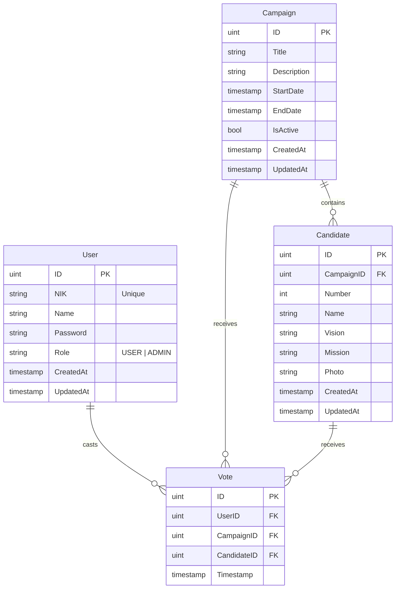

# Database Schema

The application currently uses **SQLite** with **GORM** for ORM mapping.

## Entity Relationship Diagram (ERD)

## Models Description

### User
Represents a voter or administrator in the system.
- **NIK**: National ID Number, used as the unique identifier for login.
- **Role**: Determines access levels (e.g., creating campaigns).

### Campaign
Represents an election event (e.g., "BEM Election 2024").
- **IsActive**: Flag to manually open/close the campaign.
- **StartDate/EndDate**: Automated scheduling handling.

### Candidate
Represents a choice within a specific campaign.
- **Number**: The ballot number assigned to the candidate.

### Vote
Represents a single ballot cast by a user.
- **Constraints**: Links User, Campaign, and Candidate to ensure integrity. A user should only vote once per campaign (enforced by application logic/business rules).
